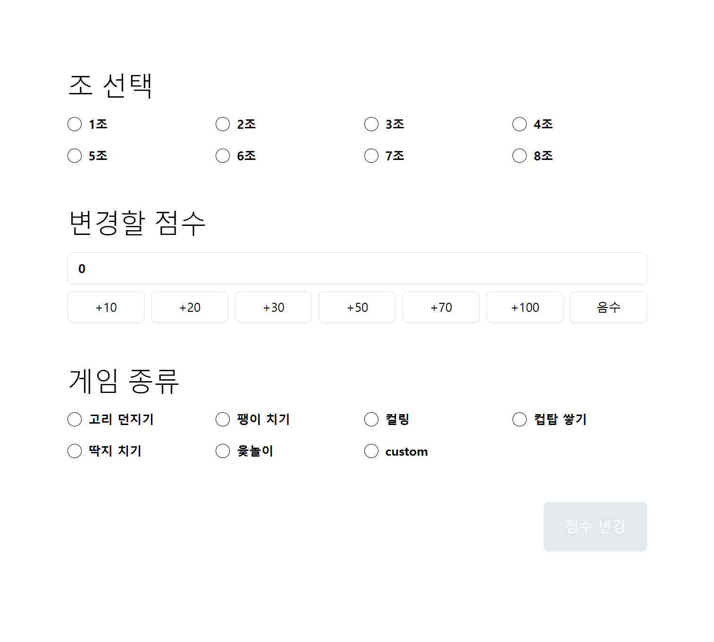

# Game Day Score

버즈빌 Mingling Program - Game Day 행사에서 사용하려고 만든 점수 현황판

### 메인


### 어드민


## 환경 설정
### SUPABASE
- SUPABASE에 `teams`, `score_updates` 테이블 생성
  - columns는 types 참고

### .env
```
NEXT_PUBLIC_SUPABASE_URL=
NEXT_PUBLIC_SUPABASE_ANON_KEY=
ADMIN_KEY=
```
- 점수 관리자만 어드민에 접근할 수 있게 URL searchParams에 있는 adminKey 값과 `ADMIN_KEY`를 비교함
